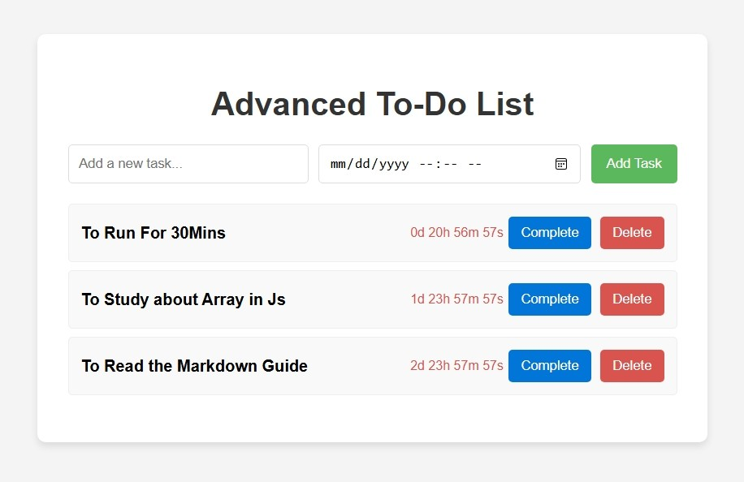
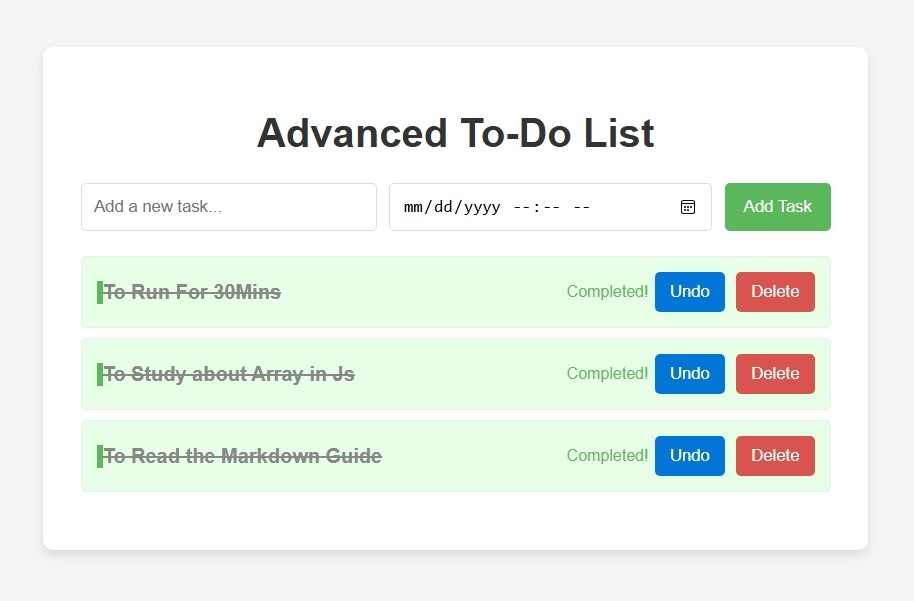
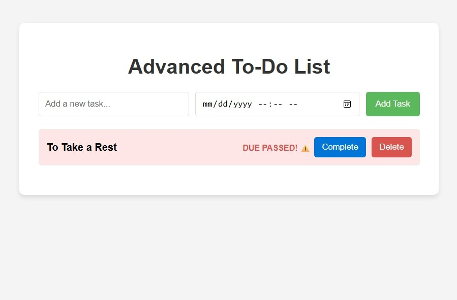

# To-Do-List-App

Hello, this is a simple lightweight snd beginner friendly To-do list app built using pure HTML, CSS, and JavaScript. This project allows users to add, delete and track daily tasks easily.

## Features
- ➕ Add new tasks

- ✔️ Mark tasks as completed

- 🗑️ Delete tasks

- 🚀 Track with timer

- 🛠️ Reselect the timer if some tasks passed the due time

## Tech Stack

- HTML5

- CSS3

- JavaScript (Vanilla JS)

No frameworks. No libraries. Just clean and simple code.

## How to Use

1. Type your task in the input field
2. Choose appropriate timer
3. Click the Add button
4. Click on a task to mark it as completed
5. Click the delete icon/button to remove a task
6. **[option]** The tasks will become red if the timer passed due time.
7. **[option]** You can reselect the time again for that task.

## Some Previews

